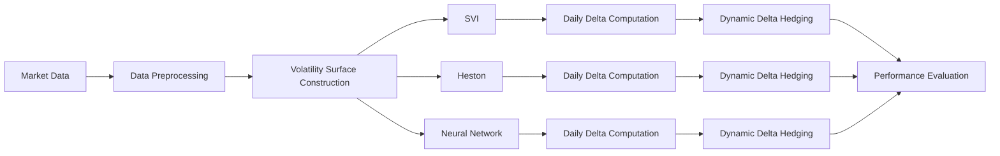

# Volatility Surface Modelling and Hedging

## Overview

This project compares three approaches to implied volatility surface construction—SVI, the Heston stochastic volatility model, and a neural network—using real AAPL and SPY option data. Rather than evaluating models solely by calibration accuracy, the project assesses their practical value through dynamic delta hedging, demonstrating how different volatility surfaces influence hedging performance.

## Data

The project uses historical **AAPL and SPY option data** over **21 trading days**. The raw dataset contains option-level information including:

- Underlying asset price
- Strike price
- Expiration date
- Option type
- Open, high, low, and close option prices
- Volume

Since the dataset does not contain a separate mid-price or market-price column, the **option close price** is used as the market price proxy for calibration and hedging calculations. The remaining OHLC and volume fields are kept in the raw dataset but are not used directly in the final modelling pipeline.

- The AAPL data contains ~ 7000 option contacts (approximately 50% calls and %50 puts)
- The SPY data contains ~ 60,000 option contracts (also approximately 50% calls and %50 puts)

### Preprocessing

The data were prepared for volatility surface construction by:

- Computing time to maturity for each option contract
- Computing log-moneyness
- Using the option close price as the market price proxy
- Checking that each trading day and maturity slice contains enough strikes for reliable SVI calibration
- Filtering and organizing the data into daily option surfaces
- Selecting a set one-month European call options for the dynamic hedging experiment

## Models

This project implements three fundamentally different approaches to implied volatility surface construction and compares them against the BS sticky model as baseline: 

| Model | Approach | Strengths | Limitations |
|:------|:---------|:----------|:------------|
| **SVI** | Parametric volatility surface | Fast calibration, excellent market fit | Requires calibration for each trading day |
| **Heston** | Stochastic volatility model | Financially interpretable, realistic volatility dynamics | Computationally expensive calibration, weaker surface fit |
| **Neural Network** | Data-driven regression | Learns complex nonlinear relationships, fast inference | Requires training data |

For the BS sticky model, we assume that the implied volatility is equal to the market implied volatility of the option on the first trading day and remains fixed throughout the hedging period.

### SVI (Stochastic Volatility Inspired)

A parametric model that fits the implied volatility smile independently for each maturity. SVI is widely used in industry due to its flexibility, computational efficiency, and ability to accurately represent market smiles.

### Heston Stochastic Volatility Model

A stochastic volatility model in which both the asset price and its variance evolve over time. Model parameters are calibrated to market option prices before extracting implied volatilities for the surface.

### Neural Network

A feedforward neural network trained to predict total implied variance directly from option's log moneyness and time to maturity, then implied volatility was derived. Once trained, the model provides fast volatility surface predictions without repeated numerical optimization.

## Workflow

## Dynamic Hedging Experiment

To evaluate each volatility surface model in practice, we simulate dynamic delta hedging for ** ~ 15 European call option contracts** with approximately one month to maturity and near ATM strike.

For each contract:

- A volatility surface is calibrated for every trading day during the option's lifetime.
- The corresponding daily delta is computed from the calibrated surface.
- The hedge portfolio is rebalanced daily using the updated delta.
- At expiration, the hedging error is computed.

### Evaluation Metric

$$\text{Relative Hedging Error} = \frac{|\text{Call Payout} - \text{Option Premium} + \text{Stock Hedging PnL}|}{\text{Option Premium}}$$

- Normalizes the hedging error by the initial option premium.
- Enables meaningful comparison across contracts with different option prices.
- Report the mean and standard deviation of the relative hedging errors over all hedging experiments.

## Results

### Surface fit (AAPL)
| Model | IV RMSE  | Vega-Weighted RMSE  | 
|:------|----------:|---------------------:|
| **SVI** | **0.063** | **0.038** |
| **Neural Network** | **0.065** | **0.032** |
| Heston | 0.18 | 0.13 |

### Hedging Performance (AAPL)

| Model | MAE  | Mean Relative Error   | Std Relative Error  |
|:------|------:|-------:|----------------------:|
| **SVI** | **1.23** | **0.113** | **0.09** |
| Heston | 2.89 | 0.44 | 0.442 |
| Neural Network | 4.04 | 0.154 | 0.09 |
|Baseline BS | 0.86 | 0.155 | 0.19

### Surface fit (SPY)

| Model | IV RMSE  | Vega-Weighted RMSE  | 
|:------|----------:|---------------------:|
| **SVI** | **0.03** | **0.016** |
| **Neural Network** | **0.068** | **0.03** |
| Heston | - | - |

### Hedging Performance (SPY)

| Model | MAE  | Mean Relative Error   | Std Relative Error  |
|:------|------:|-------:|----------------------:|
| SVI | 5.8 | 0.357 | 0.1 |
| **Neural Network** | **4.59** | **0.271** | **0.1** |
| Heston | - | - | - |
|Baseline BS | 4.9 | 0.296 | 0.08

## Key Results

AAPL
- SVI achieved the best overall performance, providing both excellent volatility surface calibration and the lowest relative hedging errors.
- NN performed competitively, exhibiting lower variability in hedging errors than the Black–Scholes baseline.
- SVI and NN outperformed the Black–Scholes baseline in terms of relative hedging error.
- BS baseline remained surprisingly competitive, despite its constant volatility assumption.
- The Heston model produced the weakest calibration and hedging performance.

SPY
- NN achieved the best hedging performance.
- The substantially larger SPY dataset (approximately 10× the size of AAPL) significantly improved the neural network's performance.
- SVI produced an excellent volatility surface fit, but this did not translate into the best hedging performance.
- The Heston model was not evaluated due to the high computational cost of repeated calibration.

Overall Conclusions
- Calibration accuracy alone is not a reliable indicator of hedging performance.
- BS baseline remained a strong benchmark, despite assuming constant volatility.
- Machine learning methods benefit substantially from larger training datasets.
- SVI proved robust on the smaller AAPL dataset, whereas the neural network excelled on the larger SPY dataset.

Overall, the results suggest that there is no universally best volatility surface model. Model performance depends not only on the modelling approach but also on the amount of available market data. Classical parametric models such as SVI are robust on smaller datasets, while data-driven neural networks become increasingly competitive as more training data become available.

## Future Work
- SSVI
- Local Volatility (Dupire)
- Physics-informed neural networks
- Deep Hedging
- Transaction costs

