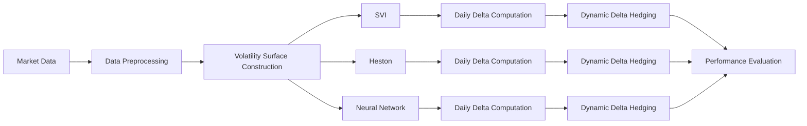

# Volatility Surface Modelling and Hedging

## Overview

This project compares three approaches to implied volatility surface construction—SVI, the Heston stochastic volatility model, and a neural network—using real AAPL and SPY option data. Rather than evaluating models solely by calibration accuracy, the project assesses their practical value through dynamic delta hedging, demonstrating how different volatility surfaces influence hedging performance.

## Data

The project uses historical **AAPL and SPY option data** over **21 trading days**. The raw dataset contains option-level information including:

- Underlying asset price
- Strike price
- Expiration date
- Option type
- Open, high, low, and close option prices
- Volume

Since the dataset does not contain a separate mid-price or market-price column, the **option close price** is used as the market price proxy for calibration and hedging calculations. The remaining OHLC and volume fields are kept in the raw dataset but are not used directly in the final modelling pipeline.

### Preprocessing

The data were prepared for volatility surface construction by:

- Computing time to maturity for each option contract
- Computing log-moneyness
- Using the option close price as the market price proxy
- Checking that each trading day and maturity slice contains enough strikes for reliable SVI calibration
- Filtering and organizing the data into daily option surfaces
- Selecting a one-month European call option for the dynamic hedging experiment

## Models

This project compares three fundamentally different approaches to implied volatility surface construction.

| Model | Approach | Strengths | Limitations |
|:------|:---------|:----------|:------------|
| **SVI** | Parametric volatility surface | Fast calibration, excellent market fit | Requires calibration for each trading day |
| **Heston** | Stochastic volatility model | Financially interpretable, realistic volatility dynamics | Computationally expensive calibration, weaker surface fit |
| **Neural Network** | Data-driven regression | Learns complex nonlinear relationships, fast inference | Requires training data, weaker hedging performance |

### SVI (Stochastic Volatility Inspired)

A parametric model that fits the implied volatility smile independently for each maturity. SVI is widely used in industry due to its flexibility, computational efficiency, and ability to accurately represent market smiles.

### Heston Stochastic Volatility Model

A stochastic volatility model in which both the asset price and its variance evolve over time. Model parameters are calibrated to market option prices before extracting implied volatilities for the surface.

### Neural Network

A feedforward neural network trained to predict implied volatility directly from option's strike and time to maturity. Once trained, the model provides fast volatility surface predictions without repeated numerical optimization.

## Workflow

## Dynamic Hedging Experiment

To evaluate each volatility surface model in practice, we simulate dynamic delta hedging for ** ~ 15 European call option contracts** with approximately one month to maturity.

For each contract:

- A volatility surface is calibrated for every trading day during the option's lifetime.
- The corresponding daily delta is computed from the calibrated surface.
- The hedge portfolio is rebalanced daily using the updated delta.
- At expiration, the hedging error is computed.

The experiment is repeated using the SVI, Heston, and neural network volatility surfaces, allowing their hedging performance to be compared under identical market conditions.

## Results

### Surface fit
| Model | IV RMSE  | Vega-Weighted RMSE  | 
|:------|----------:|---------------------:|
| **SVI** | **0.063** | **0.038** |
| **Neural Network** | **0.065** | **0.032** |
| Heston | 0.18 | 0.13 |

### Hedging Performance

| Model | MAE  | RMSE  | Mean Relative Error  |
|:------|------:|-------:|----------------------:|
| **SVI** | **1.23** | **1.62** | **11.4%** |
| Heston | 2.89 | 3.20 | 44.3% |
| Neural Network | 4.04 | 5.08 | 78.4% |

## Key Results

- SVI achieved the best overall hedging performance.
- The neural network produced the most accurate volatility surface fit but the weakest hedge.
- Heston calibrated less accurately than SVI and the neural network, yet outperformed the neural network in dynamic hedging.
- Calibration accuracy alone was not a reliable indicator of hedging performance.

## Future Work
- SSVI
- Local Volatility (Dupire)
- Physics-informed neural networks
- Deep Hedging
- Transaction costs

